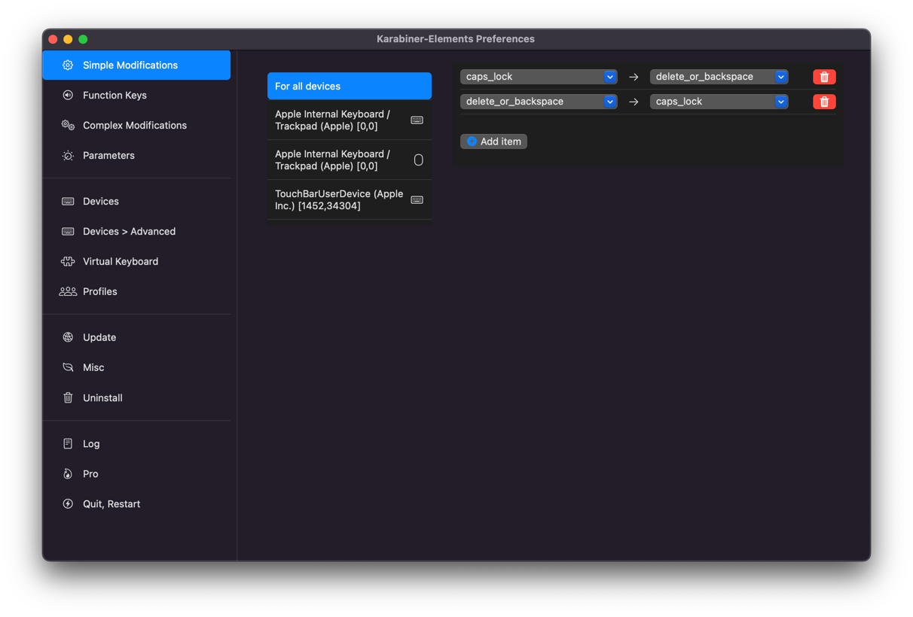

Colemak DH and Colemak DHk for macOS
====================================

macOS keylayout bundles for Colemak DH and Colemak DHk. Each bundle has
support for ANSI, ISO, and Matrix keyboards in both regular and
"Extended" deadkey variants. These layouts are based off of the built-in
"ABC" and "ABC - Extended" layouts that come with macOS.

## Download (Quick Start)

1. From the [project's main page](https://github.com/ColemakMods/mod-dh), click on the **Code** button, then **Download ZIP**
2. Extract the downloaded ZIP file.
3. Locate the "macOS" folder containing the Colemak-DH bundle files.

## Install

To install, simply copy the `Colemak DH.bundle` or `Colemak DHk.bundle`
file to your `Keyboard Layouts` directory. There are two possible
`Keyboard Layouts` directories to choose from:

- `/Library/Keyboard Layouts` aka
  `Macintosh HD > Library > Keyboard Layouts`  
  Installing to this directory will install the keyboard layout
  system-wide for all users. This is the preferred installation
  directory.
- `~/Library/Keyboard Layouts` aka
  `Macintosh HD > Users > USERNAME > Library > Keyboard Layouts`  
  This is your personal user-local keyboard layouts directory. The
  easiest way to navigate there is to open a new Finder window, select
  `Go` from the top menu, hold the Option key on the keyboard and select
  the `Library` menu item. From there, if the `Keyboard Layouts` directory
  does not exist, you must make it yourself.  Installing to this directory
  will install the keyboard layout for you only and not other users on the
  system. **Be warned!** Using the user-local installation directory does
  not allow the layout to be used in sensitive inputs like password entry
  dialogues; you may find that macOS will switch you off of your selected
  keyboard layout from time to time if it is installed here.

After installation, you may need to log out of your system and log back
in for the keyboard layout to become available in your System
Preferences.

To enable the installed keyboard layout, launch the System Preferences
app and navigate to Keyboard -> Input Sources and use the + button in
the bottom left corner of the pane to select your desired keyboard
layout. The newly installed keyboard layouts should be available in the
"English" section.

## Backspace and Capslock swap

Install Karabiner-Elements from [https://karabiner-elements.pqrs.org](https://karabiner-elements.pqrs.org/)

1. Go to Karabiner Elements Preferences
2. Simple Modifications tab
3. Add Item
4. From: `caps_lock` To: `delete_or_backspace`

that's it - the change should apply instantly.
